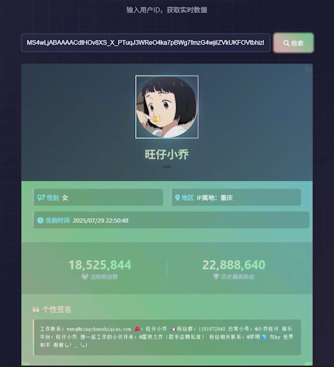

# DouyinFetch
## **抖音用户主页信息监控**
| 该工具可获取抖音用户主页信息, 如**头像**, **昵称**, **粉丝数**, **ip属地**, **个性签名**等信息

## 运行方式
### 环境要求
* Python>=3.12
### 本地部署

1. 克隆项目到本地
```
git clone https://github.com/1716285375/DouyinFetch.git
```
2. 安装依赖包
```
pip install -r requirements.txt
```
3. 运行 main.py
```
python main.py
```
4. 打开 index.html
```
4.1 输入要查询的用户sec_id
4.1.1 进入用户主页后, 浏览器对应的网址如下
https://www.douyin.com/user/MS4wLjABAAAACdtHOv8XS_X_PTuqJ3WReO4ka7pBWg7fmzG4wjiIZVkUKFOVtbhizl9GkpdOJ-O1?from_tab_name=main
4.1.2 截取user/ ?/from_tab_name之间的字符串
4.1.3 即 [MS4wLjABAAAACdtHOv8XS_X_PTuqJ3WReO4ka7pBWg7fmzG4wjiIZVkUKFOVtbhizl9GkpdOJ-O1]
4.2 点击查询
```

## 结构展示
1. 工具首页
<div align="center">
<a href="https://www.douyin.com/user/self?from_tab_name=live&modal_id=7524562945532120339&showTab=post">
  
</a>
</div>
2. 查询结果
<div align="center">
<a href="https://www.douyin.com/user/self?from_tab_name=live&modal_id=7524562945532120339&showTab=post">
  
</a>
</div>